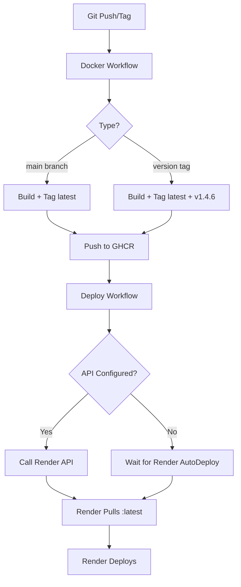

# Configuration du Déploiement Automatique sur Render

Ce document explique comment configurer le déploiement automatique sur Render via GitHub Actions.

## 🔧 Configuration Requise

### 1. Secrets GitHub

Configurez les secrets suivants dans **Settings → Secrets and variables → Actions**:

#### `RENDER_API_KEY` (Optionnel mais recommandé)
- **Obtention**: https://dashboard.render.com/u/settings → API Keys
- **Description**: Clé API Render pour déclencher les redéploiements
- **Format**: `rnd_xxxxxxxxxxxxxxxxxxxxx`

#### `RENDER_SERVICE_ID` (Optionnel mais recommandé)
- **Obtention**: Dashboard Render → Votre service → URL contient `srv-xxxxx`
- **Description**: ID du service Render à déployer
- **Format**: `srv-xxxxxxxxxxxxxxxxxxxxx`
- **Exemple**: Dans l'URL `https://dashboard.render.com/web/srv-abc123def456`, l'ID est `srv-abc123def456`

### 2. Configuration Render

Le fichier `render.yaml` doit avoir:
```yaml
services:
  - type: web
    name: pdf-xml-asycuda-api
    runtime: image
    image:
      url: ghcr.io/kkzakaria/pdf-xml-asycuda:latest
    autoDeploy: true  # Important!
```

## 🚀 Fonctionnement

### Avec API Render (Recommandé)

**Avantages**:
- ✅ Redéploiement instantané et forcé
- ✅ Confirmation du déclenchement
- ✅ Logs détaillés dans GitHub Actions

**Workflow**:
1. Push sur `main` ou création d'un tag `v*.*.*`
2. GitHub Actions construit l'image Docker
3. L'image est poussée vers GHCR avec le tag `:latest` (toujours)
4. GitHub Actions appelle l'API Render pour forcer le redéploiement
5. Render pull l'image `:latest` et redéploie

### Sans API Render (Fallback)

**Workflow**:
1. Push sur `main` ou création d'un tag `v*.*.*`
2. GitHub Actions construit l'image Docker
3. L'image est poussée vers GHCR avec le tag `:latest`
4. Render détecte automatiquement le changement (peut prendre quelques minutes)
5. Render pull l'image `:latest` et redéploie

**Note**: Sans les secrets API, le déploiement automatique fonctionne toujours mais peut être plus lent (détection automatique par Render).

## 🔍 Vérification

### Vérifier que le Tag `:latest` est Mis à Jour

```bash
# Après un tag v1.4.6, vérifier que :latest pointe vers cette version
docker pull ghcr.io/kkzakaria/pdf-xml-asycuda:latest
docker pull ghcr.io/kkzakaria/pdf-xml-asycuda:v1.4.6

# Les deux images doivent avoir le même digest
docker inspect ghcr.io/kkzakaria/pdf-xml-asycuda:latest | jq -r '.[0].Id'
docker inspect ghcr.io/kkzakaria/pdf-xml-asycuda:v1.4.6 | jq -r '.[0].Id'
```

### Vérifier le Déploiement sur Render

```bash
# Vérifier la version de l'API déployée
curl https://pdf-xml-asycuda-api.onrender.com/api/v1/health | jq .
```

## ⚡ Protection Race Condition (v1.6.1+)

### Problème Identifié

**Race condition** entre le push Docker et le déploiement Render:

```
Timeline problématique (avant v1.6.1):
├─ 00:00 ⏰ Workflow docker.yml COMPLETED (status "success")
├─ 00:03 🚀 deploy-render.yml DÉMARRE immédiatement
├─ 00:03 📡 Render reçoit la commande de redéploiement
└─ 00:23 📦 Image :latest FINIT d'être pushée (20s APRÈS!)

Résultat: Render pull l'ancienne image car la nouvelle n'est pas encore dans GHCR!
```

### Solution Implémentée (Combinée)

Le workflow `deploy-render.yml` inclut maintenant deux protections:

#### 1. **Délai de Sécurité** (60 secondes)
Attente fixe pour que le push Docker multi-plateforme se termine:
```yaml
- name: Wait for image availability
  run: sleep 60
```

#### 2. **Vérification Manifest avec Retries**
Vérification active que l'image est disponible dans GHCR:
```yaml
- name: Verify image in registry
  run: |
    docker manifest inspect ghcr.io/kkzakaria/pdf-xml-asycuda:${TAG}
    # Max 5 tentatives, 15s entre chaque
```

**Garanties**:
- ✅ L'image est vérifiée disponible avant le déploiement Render
- ✅ Multi-plateforme confirmé (linux/amd64, linux/arm64)
- ✅ Échec rapide si l'image n'est pas disponible après 135s total

## 🐛 Résolution de Problèmes

### Problème: Render déploie une ancienne version

**Cause**: Race condition entre Docker push et Render deploy (résolu en v1.6.1+)

**Solution**:
1. ✅ Le workflow inclut maintenant un délai + vérification manifest
2. ✅ L'image est garantie disponible avant déclenchement Render
3. ✅ Vérifier les logs GitHub Actions → "Verify image in registry"

### Problème: Render ne redéploie pas automatiquement

**Causes possibles**:
1. ❌ Le tag `:latest` n'est pas mis à jour (vérifié par le fix dans `docker.yml`)
2. ❌ `autoDeploy: true` n'est pas configuré dans `render.yaml`
3. ❌ Les secrets API ne sont pas configurés (fallback sur détection automatique)

**Solutions**:
1. ✅ Vérifier que le workflow Docker a bien poussé le tag `:latest`
2. ✅ Configurer les secrets `RENDER_API_KEY` et `RENDER_SERVICE_ID`
3. ✅ Vérifier les logs GitHub Actions → Deploy to Render

### Problème: Erreur "Unauthorized" dans GitHub Actions

**Cause**: `RENDER_API_KEY` invalide ou expiré

**Solution**:
1. Régénérer une nouvelle clé API sur https://dashboard.render.com/u/settings
2. Mettre à jour le secret `RENDER_API_KEY` dans GitHub

### Problème: Le service ne démarre pas après le déploiement

**Cause**: Image Docker incompatible ou erreur de configuration

**Solution**:
1. Vérifier les logs Render: Dashboard → Service → Logs
2. Tester l'image localement:
   ```bash
   docker pull ghcr.io/kkzakaria/pdf-xml-asycuda:latest
   docker run -p 8000:8000 ghcr.io/kkzakaria/pdf-xml-asycuda:latest
   ```

## 📊 Workflow Détaillé



## ✅ Checklist Post-Configuration

- [ ] Secrets GitHub configurés (RENDER_API_KEY, RENDER_SERVICE_ID)
- [ ] `render.yaml` a `autoDeploy: true`
- [ ] Workflow Docker pousse le tag `:latest` (vérifié dans `docker.yml:48`)
- [ ] Test de déploiement manuel: `workflow_dispatch` depuis GitHub Actions
- [ ] Vérification du endpoint health: `curl https://pdf-xml-asycuda-api.onrender.com/api/v1/health`

## 🔗 Liens Utiles

- [Dashboard Render](https://dashboard.render.com)
- [API Render Documentation](https://api-docs.render.com)
- [GitHub Actions Logs](https://github.com/kkzakaria/pdf-xml-asycuda/actions)
- [GHCR Packages](https://github.com/kkzakaria/pdf-xml-asycuda/pkgs/container/pdf-xml-asycuda)
